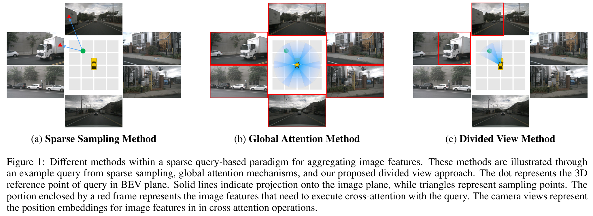
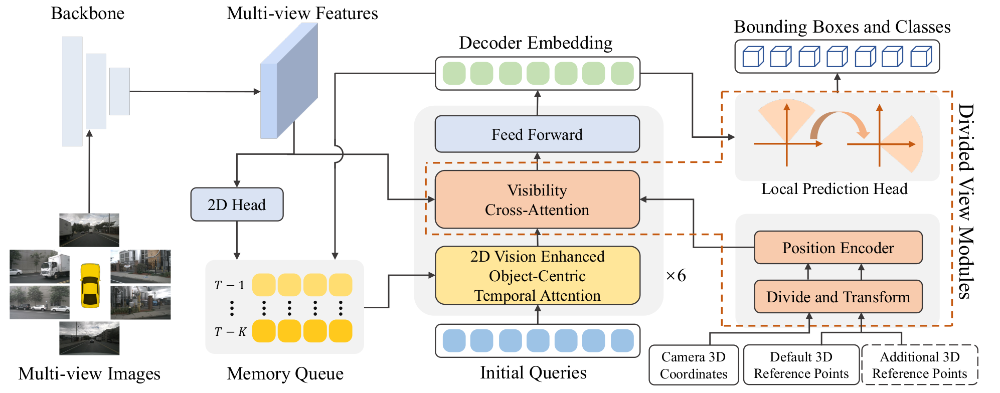

<div align="center">
<h1>DVPE</h1>
<h3>[IJCAI2024] DVPE: Divided View Position Embedding for Multi-View 3D Object Detection</h3>

</div>

## Introduction
This repository is an official implementation of [DVPE](https://arxiv.org/abs/2407.16955).
<div align="center">

</div>

## Getting Started

We provide the documentation to get started:
- [Getting Started](./setup.md)
## Results on NuScenes Val Set
| Model | Setting |Pretrain| Epoch | NDS| mAP| Config |
| :---: | :---: | :---: | :---: | :---:|:---:| :---: |
| DVPE | R50-704x256-900q | [R50-nuImage](https://download.openmmlab.com/mmdetection3d/v0.1.0_models/nuimages_semseg/cascade_mask_rcnn_r50_fpn_coco-20e_20e_nuim/cascade_mask_rcnn_r50_fpn_coco-20e_20e_nuim_20201009_124951-40963960.pth) | 24 | 0.5542| 0.4547 | [config](projects/configs/DVPE/dvpe_ablation_nui_704_bs4_24e_900q_gpu4.py) |
| DVPE | R50-704x256-900q | [R50-ImageNet](https://download.pytorch.org/models/resnet50-0676ba61.pth) | 90 | 0.555 | 0.4496 | [config](projects/configs/DVPE/dvpe_train_in1k_704_bs4_90e_900q_gpu4.py) |
| DVPE | R50-704x256-428q | [R50-nuImage](https://download.openmmlab.com/mmdetection3d/v0.1.0_models/nuimages_semseg/cascade_mask_rcnn_r50_fpn_coco-20e_20e_nuim/cascade_mask_rcnn_r50_fpn_coco-20e_20e_nuim_20201009_124951-40963960.pth) | 60 | 0.559| 0.4658 | [config](projects/configs/DVPE/dvpe_train_nui_704_bs4_60e_428q_gpu4.py) |
| DVPE | R101-1408x512-900q | [R101-nuImage](https://download.openmmlab.com/mmdetection3d/v0.1.0_models/nuimages_semseg/cascade_mask_rcnn_r101_fpn_1x_nuim/cascade_mask_rcnn_r101_fpn_1x_nuim_20201024_134804-45215b1e.pth) | 60 |0.6032 | 0.5206 | [config](projects/configs/DVPE/xx.py) |

## Results on NuScenes Test Set
| Model | Setting |Pretrain| Epoch | NDS| mAP|
| :---: | :---: | :---: | :---: | :---:|:---:|
| DVPE | V99-1600x640-900q | [V99-DD3D](https://github.com/exiawsh/storage/releases/download/v1.0/dd3d_det_final.pth) | 60 | 0.6445 | 0.5723 | 

## Acknowledgement
Many thanks to these excellent open-source projects:
- [StreamPETR](https://github.com/exiawsh/StreamPETR)
- [PETR](https://github.com/megvii-research/PETR)
- [mmdet3d](https://github.com/open-mmlab/mmdetection3d)

## Citation
If you find this project useful in your research, please cite our paper:
```bibtex
@article{wang2024dvpe,
  title={DVPE: Divided View Position Embedding for Multi-View 3D Object Detection},
  author={Wang, Jiasen and Li, Zhenglin and Sun, Ke and Liu, Xianyuan and Zhou, Yang},
  journal={arXiv preprint arXiv:2407.16955},
  year={2024}
}
```